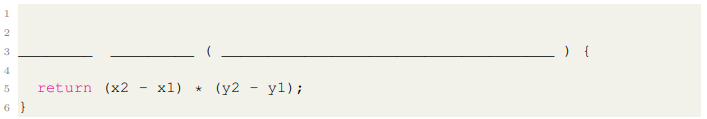
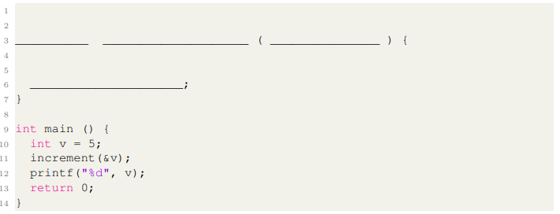
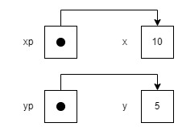
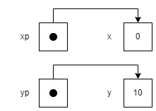
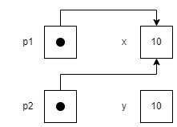

# Handin week 3

## Exercise 1


``` c
int area(int x1, int x2, int y1, int y2)
```

## Exercise 2


```c
void increment(int *p){
 *p += 1;
}
```

## Exercise 3

x = 10, y = 5, \*xp = 10 \*yp = 5 



## Exercise 4

x = 0, y = 10, \*xp = 0 \*yp = 10




## Exercise 5

x = 10, y = 10, \*p1 = 10 \*p2 = 10


